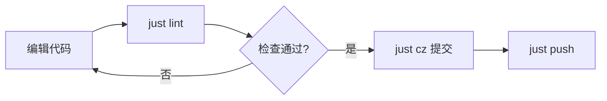
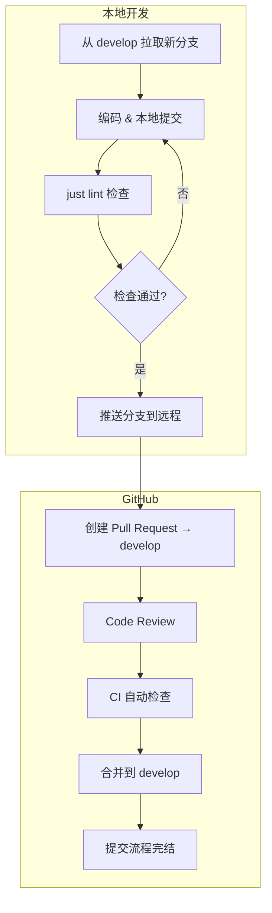

# TJLL

> 前后端分离项目 · 初始化阶段

---

## 目录

- [技术栈](#技术栈)
- [快速开始](#快速开始)
- [Zed 连接 GitHub](#zed-连接-github)
- [项目结构](#项目结构)
- [开发流程](#开发流程)
- [分支管理与协作流程](#分支管理与协作流程)
- [提交规范](#提交规范)
- [版本发布](#版本发布)
- [依赖管理](#依赖管理)
- [CI/CD（待配置）](#cicd待配置)
- [常见问题](#常见问题)

---

## 技术栈

| 层 | 技术 | 说明 |
|---|---|---|
| **后端** | Python 3.14+ | — |
| **前端** | （待定） | 推荐 Vue / React + TypeScript |
| **包管理** | [uv](https://docs.astral.sh/uv/) | 统一管理 Python 依赖 |
| **代码检查** | Ruff（lint + format） | 替代 Flake8 / Black / isort |
| **类型检查** | mypy | 仅检查 `backend/` |
| **提交规范** | Commitizen | 约定式提交（Conventional Commits） |
| **Git 钩子** | prek / pre-commit | 提交前自动检查 |
| **命令简化** | [just](https://just.systems/) | 类似 make，跨平台 |

---

## 快速开始

### 前置依赖

| 工具 | 安装方式 |
|---|---|
| **uv** | `pip install uv` 或参考 [官方文档](https://docs.astral.sh/uv/#installation) |
| **just** | `winget install casey.just` — 或参考 [GitHub Releases](https://github.com/casey/just/releases) |
| **prek**（可选） | `cargo install prek` — 更快，不装会自动回退到 `pre-commit`（Python 版） |
| **Git** | 确保已安装并初始化仓库 |

### 一键初始化

```bash
just install
```

这条命令会：
1. `uv sync --all-groups` — 安装所有 Python 依赖（包括 dev 依赖）
2. `pre-commit install` — 安装 pre-commit 钩子
3. `pre-commit install --hook-type commit-msg` — 安装提交信息检查钩子

> **提示**：如果安装了 `prek`，会自动使用 `prek` 代替 `pre-commit`，速度更快。

---

## Zed 连接 GitHub

### 1. 在 Zed 中登录 GitHub 账号

Zed 内置了 GitHub 集成，在不离开编辑器的情况下就能管理仓库、创建 PR 和查看审查。

**操作步骤：**

1. 打开 Zed，点击左下角 **⚙️ → Settings**（或按 `Ctrl+,`）
2. 在设置搜索栏输入 `git`
3. 找到 **`Git -> GitHub Auth`**，点击 **Sign in with GitHub**
4. 浏览器自动打开 GitHub 授权页面，点击 **Authorize Zed**
5. 授权完成后回到 Zed，状态栏显示 ✅ 即代表登录成功

> 如果浏览器没有自动弹出，手动复制终端/弹窗中的 URL 到浏览器访问即可。

**验证是否生效：**

- 打开命令面板（`Ctrl+Shift+P`），输入 `git: fetch`，正常拉取即认证通过
- 或查看 `~/.config/zed/github_auth.json`（Windows 路径：`%APPDATA%/Zed/github_auth.json`）

### 2. 在 GitHub 上创建远程仓库

**方式一：GitHub 网页创建（推荐）**

1. 浏览器打开 [github.com/new](https://github.com/new)
2. 仓库名：`tjll`（建议与本地同名）
3. 描述：`TJLL - 前后端分离项目`
4. 可见性：选择 **Private** 或 **Public**
5. **不要勾选** "Add a README"、".gitignore"、"License"（本地已有）
6. 点击 **Create repository**

**方式二：GitHub CLI（命令行）**

```bash
# 先安装 GitHub CLI：https://cli.github.com/
gh auth login                                  # 登录 GitHub 账号
gh repo create tjll --private --source=. --remote=origin --push
```

### 3. 关联本地仓库并推送

```bash
# 先做一次本地提交（确保有内容可推）
git add -A
git commit -m "chore: init project structure"

# 添加远程仓库（用你刚创建的实际地址替换）
git remote add origin https://github.com/<你的用户名>/tjll.git

# 推送到远程
just push-u main
```

> 如果远程仓库默认分支名为 `master`，先统一改为 `main`：
> ```bash
> git branch -M main
> ```

### 4. 邀请协作者

1. 浏览器打开仓库 → **Settings → Collaborators → Add people**
2. 输入队友的 GitHub 用户名
3. 队友接受邀请后即可 clone

**队友首次拉取代码：**

```bash
git clone https://github.com/<你的用户名>/tjll.git
cd tjll
just install    # 安装依赖和钩子
```

---

## 项目结构

```
tjll/
├── backend/               # 后端代码（Python）
│   ├── config.py          # 配置（读同目录 .env）
│   ├── .env.example       # 环境变量模板（提交）
│   ├── main.py
│   └── RAG/               # 文档 / 检索 / OpenSearch / 模型 / 基础设施
│       ├── document/
│       ├── retrieve/
│       ├── opensearch/
│       ├── models/        # 权重本地放置，不入 git
│       └── infra/         # docker-compose / Dockerfile（*.example 入 git）
├── frontend/              # 前端代码（待定）
│   └── .gitkeep
├── .pre-commit-config.yaml
├── justfile
├── pyproject.toml
├── uv.lock
└── README.md
```

---

## 开发流程

### 1. 日常开发循环



### 2. 代码检查

提交前建议手动运行全套检查：

```bash
# 一键运行所有检查（自动修复 + 格式检查 + 类型检查）
just lint

# 如果只想单独运行某项：
just fix         # ruff 自动修复 lint
just fmt-check   # 只检查格式，不修改
just fmt         # 自动格式化
just mypy        # 后端类型检查
just ty          # 额外类型检查（可选）
```

### 3. 提交代码

```bash
just cz
```

这会启动 Commitizen 交互式界面，引导你填写符合规范的 commit 消息：

```
? Select the type of change you're committing:
  feat     — 新功能
  fix      — 修复 Bug
  docs     — 文档更新
  style    — 代码格式（不影响功能）
  refactor — 重构（既不是修复也不是新功能）
  perf     — 性能优化
  test     — 测试相关
  chore    — 构建/工具/依赖变更
  ...
? Tell us about this change: (提交描述)
```

**为什么用 `just cz` 而不是 `git commit`？**

- Commitizen 保证每条消息都遵循 Conventional Commits 标准
- 规范的消息格式让 `cz bump` 能自动推断版本号和生成 CHANGELOG
- Git 历史更清晰，便于 Code Review 和回溯

### 4. pre-commit 钩子

当执行 `git commit` 时，pre-commit 会自动运行以下检查：

| 阶段 | 钩子 | 作用 |
|---|---|---|
| pre-commit | check-added-large-files | 防止提交大文件（>750KB） |
| pre-commit | check-toml | 检查 TOML 语法 |
| pre-commit | check-yaml | 检查 YAML 语法 |
| pre-commit | end-of-file-fixer | 确保文件末尾有换行符 |
| pre-commit | trailing-whitespace | 删除行尾空格 |
| pre-commit | typos | 拼写检查 |
| pre-commit | ruff check | 自动修复 lint 问题 |
| pre-commit | ruff format | 自动格式化代码 |
| pre-commit | mypy check | 后端类型检查 |
| commit-msg | commitizen check | 检查提交消息格式 |

> 如果某次提交需要跳过钩子：`git commit --no-verify`（仅限紧急情况）。

### 5. 推送代码

```bash
# 推送到当前分支对应的远程分支
just push

# 首次推送新分支（将本地分支与远程关联）
just push-u <分支名>
```

### 6. 手动运行所有钩子

```bash
just check
```

---

## 分支管理与协作流程

多人开发时，统一的分支策略和协作规范比代码本身更重要。

### 分支策略（Git Flow 简化版）

```
main          ── 生产就绪代码，只从 develop / hotfix 合并
  │
develop       ── 日常开发集成分支，功能分支从这里拉出
  │
  ├── feat/xxx       新功能开发
  ├── fix/xxx        Bug 修复
  ├── refactor/xxx   重构
  ├── docs/xxx       文档
  └── hotfix/xxx     生产环境紧急修复（直接从 main 拉出，修复后合并回 main 和 develop）
```

### 分支命名规范

```
feat/xxx       ── 新功能     例：feat/user-auth
fix/xxx        ── 修复 Bug   例：fix/login-crash
refactor/xxx   ── 重构       例：refactor/api-routes
docs/xxx       ── 文档       例：docs/api-spec
chore/xxx      ── 杂项       例：chore/upgrade-deps
hotfix/xxx     ── 紧急修复   例：hotfix/payment-null
```

### 完整协作流程



### 详细步骤说明

#### 第一步：同步最新代码

```bash
# 切到 develop 分支并拉取最新
git checkout develop
git pull

# 创建你的功能分支
git checkout -b feat/xxx
```

#### 第二步：开发与提交

```bash
# 写代码 → 检查 → 提交（循环）
just lint        # 确保代码没有问题
just cz          # 交互式提交，生成规范 commit
```

> 建议：一个小功能可以多次 commit，保持历史清晰。最后合并到 `develop` 前再整理。

#### 第三步：推送并创建 Pull Request

```bash
# 推送你的分支到远程（首次用 -u）
just push-u feat/xxx
```

然后去 GitHub 网页操作：

1. 进入仓库页面，点击 **Pull requests → New pull request**
2. **base** 选 `develop`，**compare** 选你的分支 `feat/xxx`
3. 填写 PR 标题和描述
4. 指派 Reviewers（代码审查人）
5. 点击 **Create pull request"

**PR 描述模板：**

```markdown
## 变更内容

<!-- 简要描述改了什么、为什么改 -->

## 相关 Issue

Closes #42

## 检查清单

- [ ] 本地运行 `just lint` 通过
- [ ] 相关测试已添加或更新
- [ ] 文档已更新（如有需要）

## 截图（可选）

<!-- 界面变化的截图 -->
```

#### 第四步：Code Review

- 审查人会在 PR 中留下评论，指出需要修改的地方
- 你直接在**同一分支**上修改、提交、推送，PR 会自动更新
- 审查人 Approve 后，由负责人合并到 `develop`

```bash
# 根据 review 意见修改代码
git add -A
just cz                        # 再次提交
just push                       # 推送到同一分支，PR 自动更新
```

#### 第五步：合并到 develop

PR 合并后：

```bash
# 切回 develop，拉取最新
git checkout develop
git pull

# 删除本地已完成的分支（可选）
git branch -d feat/xxx

# 删除远程已合并的分支（可选）
just branch-delete feat/xxx
```

### 发布流程（develop → main）

当 `develop` 累积了足够的功能，准备发布新版时：

```bash
# 切到 main
git checkout main
git pull

# 合并 develop
git merge develop

# 使用 Commitizen 打版本标签
just cz-bump patch   # 或 minor / major，取决于变更范围

# 推送 main 和 tag
just push-tags
```

> 生产环境紧急修复走 `hotfix` 分支，直接从 `main` 拉出：
> ```bash
> git checkout -b hotfix/xxx main
> # 修复 → 检查 → 提交
> just cz
> # 合并到 main 和 develop
> git checkout main && git merge hotfix/xxx
> git checkout develop && git merge hotfix/xxx
> ```

### 原则

| 原则 | 说明 |
|---|---|
| **永远不要在 main 上直接开发** | main 只接受从 develop / hotfix 合并来的代码 |
| **功能开发从 develop 拉分支** | 保证 develop 始终是最新的集成分支 |
| **PR 必须经过 Code Review** | 至少一人 Approve 后才能合并 |
| **推送前跑 just lint** | 避免无意义的 CI 失败 |
| **commit 消息用规范格式** | 使用 `just cz` 而非 `git commit` |
| **及时删除已合并的分支** | 保持仓库整洁 |

---

## 提交规范

本项目采用 **约定式提交（Conventional Commits）**。

### 消息格式

```
<type>(<scope>): <subject>

<body>

<footer>
```

### 常用类型

| 类型 | 说明 | 版本影响 |
|---|---|---|
| `feat` | 新功能 | 次版本号+ |
| `fix` | 修复 Bug | 修订号+ |
| `docs` | 文档变更 | — |
| `style` | 代码格式（空格、分号等） | — |
| `refactor` | 重构 | — |
| `perf` | 性能优化 | — |
| `test` | 增加或修改测试 | — |
| `chore` | 构建工具、依赖等变更 | — |
| `ci` | CI/CD 配置变更 | — |

### 示例

```
feat(auth): 添加 JWT 登录认证

实现基于 JWT 的用户登录接口，支持 access_token 和 refresh_token。
新增 /api/auth/login 和 /api/auth/refresh 两个端点。

Closes #42
```

```
fix(api): 修复用户列表分页参数为空时的崩溃

当 page_size 参数为空字符串时，int() 转换会导致 ValueError。
现在添加了默认值处理。

Fixes #18
```

---

## 版本发布

```bash
# 自动推断版本增量（根据 commit 消息）
just cz-bump

# 手动指定
just cz-bump patch   # 1.0.0 → 1.0.1
just cz-bump minor   # 1.0.0 → 1.1.0
just cz-bump major   # 1.0.0 → 2.0.0
```

`cz bump` 会自动：
1. 更新 `pyproject.toml` 中的版本号
2. 生成/更新 `CHANGELOG.md`
3. 创建 Git tag（格式：`v1.0.0`）
4. 创建一个版本发布的 commit

> 首次运行前请确保远程仓库已配置。后续可配合 CI/CD（GitHub Actions）实现推送 tag 自动发布。

---

## 依赖管理

```bash
# 添加生产依赖
just add fastapi

# 添加开发依赖
just add-dev pytest pytest-asyncio

# 移除依赖
just remove fastapi

# 升级所有依赖
just uv-upgrade

# 查看过期依赖
just uv-outdated
```

---

## CI/CD（待配置）

后续将集成 GitHub Actions，在推送和 PR 时自动运行：

| 触发时机 | 任务 |
|---|---|
| push / PR → main 或 develop | ruff check, ruff format --check, mypy backend |
| 推标签 v* | 自动发布（构建 + 部署） |
| push → main | 自动更新 CHANGELOG（可选） |

届时会补充 `.github/workflows/` 目录下的 workflow 文件。

---

## 常见问题

### `prek` 和 `pre-commit` 有什么区别？

- **`pre-commit`**（Python）：官方实现，随 `pip` 安装，生态成熟
- **`prek`**（Rust）：社区实现的 Rust 版，兼容相同配置格式，速度更快
- 本项目两者皆可，`justfile` 自动检测优先使用 `prek`，不存在则回退到 `pre-commit`

### 如何更新 pre-commit 钩子版本？

```bash
just prek-update
```

这会拉取所有仓库的最新版本并更新 `.pre-commit-config.yaml`。

### Windows 下运行 just 命令报错？

- 确保你的终端是 PowerShell、CMD 或 Git Bash（部分命令依赖 `sh`）
- `just` 默认使用 `sh` 执行命令，Windows 下 Git Bash 自带 `sh`
- 如果中文注释导致编码问题，将终端编码设为 UTF-8：`chcp 65001`

### 如何创建新的贡献分支？

```bash
git checkout -b feat/xxx   # 新功能
git checkout -b fix/xxx    # 修复
git checkout -b docs/xxx   # 文档
```
