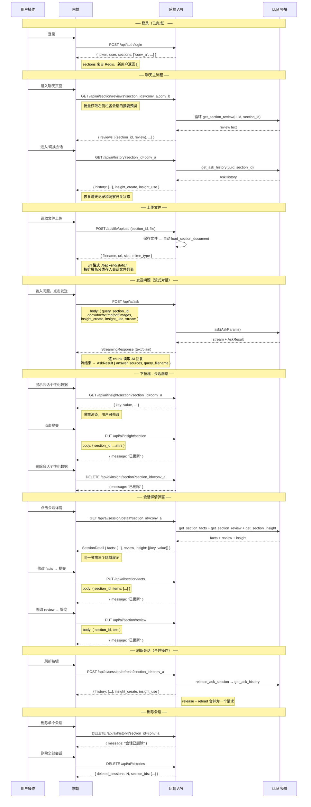

## 登录：

用户登录成功，调用get_sectionIDs接口，传入uuid参数，获取该用户uuid对应的所有section_id：list[section_ids]。
用户登出成功，调用release_ask_sessions_by_uuid接口，传入uuid参数，成功返回true。

## 总设置：

用户可选择在总设置里，设置接下来创建的每个新对话的默认设置选项，包括允许创建洞察，和使用已有的洞察优化用户体验，该设置项数据库长期保存，不需要调接口。
总设置里，有展示用户画像按钮，点击会调用get_user_insight接口，该接口返回字典类型数据。前端弹窗渲染：{key:value...}，该渲染弹窗内，允许用户修改、删除、增加内容，完成后，底部有提交按钮，点击会调用update_user_insight_attrs，按照uuid+{key:value...}方式调用，成功返回true.同时总设置里有删除用户画像按钮，点击会调用delete_user_insight，传入uuid参数，返回true标志删除成功。总设置里有删除所有画像数据，点击后调用delete_all_insights，传入uuid参数，返回true标志删除成功。

## 聊天：

1. **进入聊天窗口**，前端根据登陆时得到的section_id列表决定默认是哪个聊天窗口，也就是决定先加载哪个section_id的历史，然后调用get_ask_history，传入uuid和section_id，得到历史AskHistory。建议，在默认窗口历史加载出来前，做一个加载页面。

   **进入聊天窗口后**，用户可以在左侧随时切换聊天窗口，切换时，先查前端有无该会话窗口历史，没有则调用get_ask_history，传入uuid和section_id，得到历史AskHistory。批注：AskHistory包含insight_create和insight_use字段，该二字段第2条里会介绍作用，AskHistory还有：list[HistoryMessage]，每条HistoryMessage包含role代表谁说的（代表用户/AI回复）content字段，代表说的什么内容。还有filename字段，该字段只有用户消息可能有值，代表这次消息用户携带了这个附加，filename包含“./backend/.../filename.格式 ”。还有sources字段，该字段只有AI回复的消息时才有值，代表本次AI回复参考了哪些RAG资料（不含用户自己上传的资料），sources字段是list[RagSnippet]，每条消息有str+metadata组成，详细看代码或指导文档。该字段可用于展示可信度。

2. 聊天界面应该有下拉框，下拉时有以下选项：

   - 当前轮是否开启个性化数据创建

   - 当前轮是否使用已有个性化数据

   - 展示会话个性化数据按钮

   - 删除会话个性话数据按钮。

     对于选项1，2，如果是新建的对话窗口，那其默认值是总设置里的默认值（即允许创建洞察，和使用已有的洞察优化用户体验）。如果不是新建的对话窗口其默认值应该为开启会话时查历史查到的AskHistory里面的insight_create:insight_use进行展示，均为bool类型。该二选项可以随时开启或关闭，状态改变不用单独调用接口。

     对于选项3，点击调用get_section_insight接口，传入uuid,section_id，得到字典类型数据，前端弹窗渲染：{key:value...}，该渲染弹窗内，允许用户修改、删除、增加内容，完成后，底部有提交按钮，点击会调用update_section_insight_attrs，传入uuid,section_id,和{key:value...}，成功返回true.

     对于选项4，点击会调用delete_section_insight接口，传入uuid和section_id，成功返回true。

3. 聊天界面下拉框旁应该有展示会话详情按钮，或者在左侧所有会话栏目展示框内，可以对某一个会话展示详情，即提供展示详情按钮。（当然如果左侧所有会话栏目展示框需要内容渲染，可以每一个section_id用uuid一起调用一次get_section_review，返回str，可以只展示固定字数内容，后续描述按照没有这个设计继续）

   **展示会话详情按钮点击后**，根据uuid和 section_id调用get_section_facts和get_section_review，get_section_facts返回list[str],里面的先后顺序代表时间顺序。get_section_review返回str。这两个内容应该同一个弹窗不同区域展示，每个区域有一个提交按钮，用户可以修改对应区域里的内容，修改完成后，点击对应区域提交按钮，分别调用：update_section_facts，传入uuid ,section_id, 以及list[str]，成功返回true.调用set_section_review，传入uuid,section_id,str ,成功返回true。

4. 前端应该提供删除会话按钮，可以指定删除某一个会话，此时传入uuid,section_id，调用delete_ask_history，成功返回删除的true。前端应该提供一键删除所有会话按钮，可以删除所有会话，传入uuid，调用delete_ask_histories_by_uuid，成功返回DeleteHistoryResult,内有删除了哪些section_ids和数目。

5. 用户处于某一个会话界面点击刷新时，应该调用一次release_ask_session，传入uuid和section_id，成功返回true。如果刷新后丢失历史，可以再调用get_ask_history，传入uuid和section_id，得到历史AskHistory。

6. **用户上传文件，后端保存文件后**，即调用load_section_document,接受uuid,section_id,以及file_path:file_path包含“./backend/.../filename.格式 ”.用户取消该文件上传不需要单独调用接口，成功返回true。当用户上传文件输入问题后，发送成功会调用ask接口，传入AskParams请求体，该请求体有：query:str,section_id:str,uuid:str字段以及insight_create，insight_use字段，该字段直接使用当前会话窗口的

   - 当前轮是否开启个性化数据创建

   - 当前轮是否使用已有个性化数据的值

   - 还有：

     docx: Any | None = None

     doc: Any | None = None

     txt: Any | None = None

     md: Any | None = None

     pdf: Any | None = None

     images: Any | None = None

     只需要把本次问题用到的文件拼接成“./backend/.../filename.格式 ”用对应格式的字段名存储就行，其他字段保持空。如果涉及多个文件，可传list[“./backend/.../filename.格式 ”].

     对于响应：先用stream接受流式回答，完毕后再用AskResult接受完整响应。响应字段包含answer，sources，query_filename，query，section_id，uuid字段，sources任然是list[RagSnippet]格式，query_filename是本次请求使用到的用户文件名，依旧是“./backend/.../filename.格式 ”

7. 用户发消息后，你们调 `ask(AskParams)`。返回值二选一：

   **A. 需要澄清**（不是流）→ `AskInterruptResult`，原样给前端渲染：

```json
{
  "uuid": "req-550e8400",
  "section_id": "user-42-session-1",
  "questions": [
    {
      "question": "人均预算大概多少？",
      "option": { "A": "100 以内", "B": "100-300", "C": "其他" }
    }
  ]
}
```

   前端用户选完点提交后，你们再调 `submit_ask_interrupt(AskInterruptSubmitParams)`：

```json
{
  "uuid": "req-550e8400",
  "section_id": "user-42-session-1",
  "answers": [
    { "question": "人均预算大概多少？", "result": "100-300" }
  ]
}
```

   返回值是 **`AskStream`**（与正常回答相同）：先 `for piece in stream` 收流式，再读 `stream.response`（`AskResult`）。

   **B. 不需要澄清** → 直接是 `AskStream`，按上面第 6 点处理即可。

   判断：`isinstance(out, AskInterruptResult)` 为真走 A，否则当流用。
   `answers` 里每道题的 `question` 必须与问卷一致；`result` 填选项原文或用户自定义文本。
   无待澄清问卷时调 `submit_ask_interrupt` 会报错。

---

## 前后端交互工作流设计



---

## 前端对接指南

### 核心概念

**`section_id`** —— 每个对话窗口的唯一标识，**由前端生成**（`crypto.randomUUID()`），一个对话窗口全程不变，上传、对话、查看历史都用同一个值。

**`uuid`** —— 当前用户的 ID，**由后端自动从 JWT 注入**，前端永远不需要传入。

### 数据来源总览

```
┌─ 前端自己生成 ────────────────────────┐
│  section_id: crypto.randomUUID()    │ 每个新对话生成一次
│  insight_create: bool               │ 本地状态（新建取设置，已有从历史恢复）
│  insight_use: bool                  │ 同上
└─────────────────────────────────────┘

┌─ 用户操作产生 ────────────────────────┐
│  query: string                      │ 用户输入的问题
│  file: File                         │ 用户选取的文件
└─────────────────────────────────────┘

┌─ 后端返回 ───────────────────────────┐
│  登录 → token, user, sections       │ sections: 该用户已有的会话 ID 列表
│  上传 → { filename, url, ... }      │ url 格式: ./backend/static/...
│  历史 → AskHistory                  │ 含聊天记录和 insight 开关状态
│  对话 → stream / AskResult          │ 含 answer 和参考来源 sources
└─────────────────────────────────────┘
```

### 接口一览（按使用场景）

#### 场景：用户登录

`POST /api/auth/login`

| 传入 | 来源 |
|---|---|
| `username`, `password` | 用户输入 |

| 返回 | 用途 |
|---|---|
| `token` | 后续请求的 Authorization header |
| `sections: ["conv_a", ...]` | 该用户已有的会话 ID，用于渲染左侧栏 |

#### 场景：进入聊天页 / 切换会话

**批量获取会话摘要（左侧栏渲染）**

`GET /api/ai/section/reviews?section_ids=conv_a,conv_b`

| 参数 | 来源 |
|---|---|
| `section_ids` | 登录响应 `sections`，逗号分隔 |

返回 `{ reviews: [{section_id, review}, ...] }`

**获取单个会话历史**

`GET /api/ai/history?section_id=conv_a`

| 参数 | 来源 |
|---|---|
| `section_id` | 前端生成或从登录响应取 |

返回 `AskHistory`（含 `history`、`insight_create`、`insight_use`）

#### 场景：上传文件

`POST /api/file/upload`（form-data）

| 字段 | 来源 |
|---|---|
| `section_id` | 当前会话 ID |
| `file` | 用户选取的文件 |

返回 `{ filename, url, size, mime_type }`

> 保存返回的 `url`，按扩展名分类存入 `docx`/`doc`/`txt`/`md`/`pdf`/`images`，后续发送 `ask` 时传入。

#### 场景：发送问题（AI 对话）

`POST /api/ai/ask`

| body 字段 | 来源 |
|---|---|
| `query` | 用户输入 |
| `section_id` | 当前会话 ID |
| `docx/doc/txt/md/pdf/images` | 上传返回的 `url`，按扩展名分类 |
| `insight_create`, `insight_use` | 下拉框当前值 |
| `stream` | 建议固定 `true` |

`stream: true` 返回 `text/plain` 流式响应；`stream: false` 返回 `AskResult` JSON。

#### 场景：下拉框操作

| 操作 | 接口 |
|---|---|
| 获取会话洞察 | `GET /api/ai/insight/section?section_id=` |
| 更新会话洞察 | `PUT /api/ai/insight/section` body: `{ section_id, ...attrs }` |
| 删除会话洞察 | `DELETE /api/ai/insight/section?section_id=` |

#### 场景：会话详情

| 操作 | 接口 |
|---|---|
| 获取详情（facts + review + insight） | `GET /api/ai/session/detail?section_id=` |
| 更新 facts | `PUT /api/ai/section/facts` body: `{ section_id, items: [...] }` |
| 更新 review | `PUT /api/ai/section/review` body: `{ section_id, text }` |

#### 场景：刷新会话

`POST /api/ai/session/refresh?section_id=conv_a`

返回 `AskHistory`（同 `GET /api/ai/history`）

#### 场景：删除会话

| 操作 | 接口 |
|---|---|
| 删除单个 | `DELETE /api/ai/history?section_id=` |
| 删除全部 | `DELETE /api/ai/histories` |

---

### 数据字段参考

**`AskHistory`（会话历史）**

```json
{
  "uuid": "u_abc",
  "section_id": "conv_a",
  "history": [
    {
      "role": "user" | "assistant",
      "content": "消息内容",
      "filename": null | "./backend/static/...",
      "sources": null | [{ "content": "...", "metadata": {...} }]
    }
  ],
  "insight_create": false,
  "insight_use": false
}
```

`history[]` 中：`filename` 仅用户消息有，`sources` 仅 AI 回复有。

**`AskResult`（AI 回答结果）**

```json
{
  "query": "用户问题",
  "section_id": "conv_a",
  "answer": "AI 回复",
  "sources": [{ "content": "...", "metadata": { "score": 0.95 } }],
  "query_filename": "./backend/static/..."
}
```

**`RagSnippet`（sources 中每一项）**

```json
{ "content": "片段正文", "metadata": { "score": 0.95, "source": "文档名" } }
```

`metadata` 字段动态，可能含 score、rerank_score 等，前端可用 `content` 展示可信度参考。
