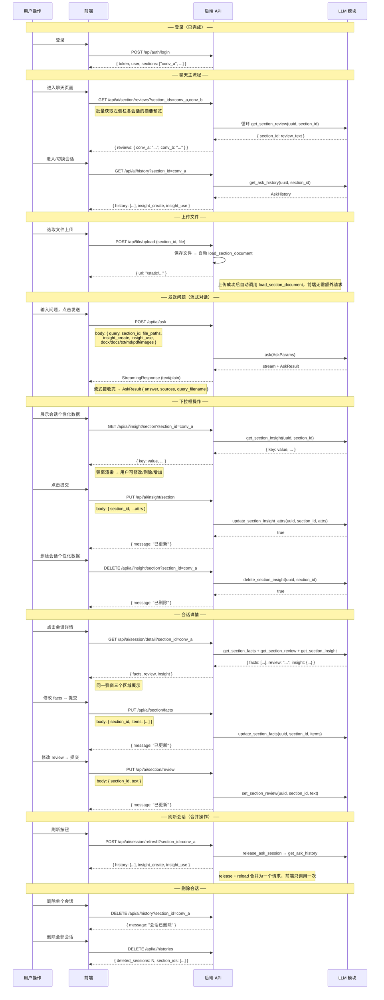

## 登录：

用户登录成功，调用get_sectionIDs接口，传入uuid参数，获取该用户uuid对应的所有section_id：list[section_ids]。
用户登出成功，调用release_ask_sessions_by_uuid接口，传入uuid参数，成功返回true。

## 总设置：

用户可选择在总设置里，设置接下来创建的每个新对话的默认设置选项，包括允许创建洞察，和使用已有的洞察优化用户体验，该设置项数据库长期保存，不需要调接口。
总设置里，有展示用户画像按钮，点击会调用get_user_insight接口，该接口返回字典类型数据。前端弹窗渲染：{key:value...}，该渲染弹窗内，允许用户修改、删除、增加内容，完成后，底部有提交按钮，点击会调用update_user_insight_attrs，按照uuid+{key:value...}方式调用，成功返回true.同时总设置里有删除用户画像按钮，点击会调用delete_user_insight，传入uuid参数，返回true标志删除成功。总设置里有删除所有画像数据，点击后调用delete_all_insights，传入uuid参数，返回true标志删除成功。

## 聊天：

1. **进入聊天窗口**，前端根据登陆时得到的section_id列表决定默认是哪个聊天窗口，也就是决定先加载哪个section_id的历史，然后调用get_ask_history，传入uuid和section_id，得到历史AskHistory。建议，在默认窗口历史加载出来前，做一个加载页面。

   **进入聊天窗口后**，用户可以在左侧随时切换聊天窗口，切换时，先查前端有无该会话窗口历史，没有则调用get_ask_history，传入uuid和section_id，得到历史AskHistory。批注：AskHistory包含insight_create和insight_use字段，该二字段第2条里会介绍作用，AskHistory还有：list[HistoryMessage]，每条HistoryMessage包含role代表谁说的（代表用户/AI回复）content字段，代表说的什么内容。还有filename字段，该字段只有用户消息可能有值，代表这次消息用户携带了这个附加，filename包含“./backend/.../filename.格式 ”。还有sources字段，该字段只有AI回复的消息时才有值，代表本次AI回复参考了哪些RAG资料（不含用户自己上传的资料），sources字段是list[RagSnippet]，每条消息有str+metadata组成，详细看代码或指导文档。该字段可用于展示可信度。

2. 聊天界面应该有下拉框，下拉时有以下选项：

   - 当前轮是否开启个性化数据创建

   - 当前轮是否使用已有个性化数据

   - 展示会话个性化数据按钮

   - 删除会话个性话数据按钮。

     对于选项1，2，如果是新建的对话窗口，那其默认值是总设置里的默认值（即允许创建洞察，和使用已有的洞察优化用户体验）。如果不是新建的对话窗口其默认值应该为开启会话时查历史查到的AskHistory里面的insight_create:insight_use进行展示，均为bool类型。该二选项可以随时开启或关闭，状态改变不用单独调用接口。

     对于选项3，点击调用get_section_insight接口，传入uuid,section_id，得到字典类型数据，前端弹窗渲染：{key:value...}，该渲染弹窗内，允许用户修改、删除、增加内容，完成后，底部有提交按钮，点击会调用update_section_insight_attrs，传入uuid,section_id,和{key:value...}，成功返回true.

     对于选项4，点击会调用delete_section_insight接口，传入uuid和section_id，成功返回true。

3. 聊天界面下拉框旁应该有展示会话详情按钮，或者在左侧所有会话栏目展示框内，可以对某一个会话展示详情，即提供展示详情按钮。（当然如果左侧所有会话栏目展示框需要内容渲染，可以每一个section_id用uuid一起调用一次get_section_review，返回str，可以只展示固定字数内容，后续描述按照没有这个设计继续）

   **展示会话详情按钮点击后**，根据uuid和 section_id调用get_section_facts和get_section_review，get_section_facts返回list[str],里面的先后顺序代表时间顺序。get_section_review返回str。这两个内容应该同一个弹窗不同区域展示，每个区域有一个提交按钮，用户可以修改对应区域里的内容，修改完成后，点击对应区域提交按钮，分别调用：update_section_facts，传入uuid ,section_id, 以及list[str]，成功返回true.调用set_section_review，传入uuid,section_id,str ,成功返回true。

4. 前端应该提供删除会话按钮，可以指定删除某一个会话，此时传入uuid,section_id，调用delete_ask_history，成功返回删除的true。前端应该提供一键删除所有会话按钮，可以删除所有会话，传入uuid，调用delete_ask_histories_by_uuid，成功返回DeleteHistoryResult,内有删除了哪些section_ids和数目。

5. 用户处于某一个会话界面点击刷新时，应该调用一次release_ask_session，传入uuid和section_id，成功返回true。如果刷新后丢失历史，可以再调用get_ask_history，传入uuid和section_id，得到历史AskHistory。

6. **用户上传文件，后端保存文件后**，即调用load_section_document,接受uuid,section_id,以及file_path:file_path包含“./backend/.../filename.格式 ”.用户取消该文件上传不需要单独调用接口，成功返回true。当用户上传文件输入问题后，发送成功会调用ask接口，传入AskParams请求体，该请求体有：query:str,section_id:str,uuid:str字段以及insight_create，insight_use字段，该字段直接使用当前会话窗口的

   - 当前轮是否开启个性化数据创建

   - 当前轮是否使用已有个性化数据的值

   - 还有：

     docx: Any | None = None

     doc: Any | None = None

     txt: Any | None = None

     md: Any | None = None

     pdf: Any | None = None

     images: Any | None = None

     只需要把本次问题用到的文件拼接成“./backend/.../filename.格式 ”用对应格式的字段名存储就行，其他字段保持空。如果涉及多个文件，可传list[“./backend/.../filename.格式 ”].

     对于响应：先用stream接受流式回答，完毕后再用AskResult接受完整响应。响应字段包含answer，sources，query_filename，query，section_id，uuid字段，sources任然是list[RagSnippet]格式，query_filename是本次请求使用到的用户文件名，依旧是“./backend/.../filename.格式 ”

---

## 前后端交互工作流设计

### 路由总表

| 方法 | 路径 | 功能 | 对应 LLM 函数 | 说明 |
|---|---|---|---|---|
| **会话管理** | | | | |
| `GET` | `/api/ai/history?section_id=` | 获取会话历史 | `get_ask_history` | 进入/切换聊天窗口时调用 |
| `POST` | `/api/ai/session/refresh?section_id=` | 刷新会话 | `release_ask_session` + `get_ask_history` | 🔀 合并：释放槽位 + 重载历史 |
| `DELETE` | `/api/ai/history?section_id=` | 删除单个会话 | `delete_ask_history` | 同时清理历史 + 文件 |
| `GET` | `/api/ai/section/reviews?section_ids=` | 批量获取会话摘要 | `get_section_review` (循环) | 左侧栏渲染用，逗号分隔多个 section_id |
| `DELETE` | `/api/ai/histories` | 删除全部会话 | `delete_ask_histories_by_uuid` | 同上 |
| **AI 对话** | | | | |
| `POST` | `/api/ai/ask` | AI 流式对话 | `ask` | body 含 `AskParams` 所有字段 |
| **文件上传** | | | | |
| `POST` | `/api/file/upload?section_id=` | 上传文件 | 保存 + `load_section_document` | 🔀 合并：保存后自动调用文档处理 |
| **会话详情** | | | | |
| `GET` | `/api/ai/session/detail?section_id=` | 获取会话详情 | `get_section_facts` + `get_section_review` + `get_section_insight` | 🔀 合并：一次返回 facts + review + insight |
| `PUT` | `/api/ai/section/facts` | 更新会话 facts | `update_section_facts` | body: `{ section_id, items: [...] }` |
| `PUT` | `/api/ai/section/review` | 更新会话 review | `set_section_review` | body: `{ section_id, text }` |
| **会话洞察** | | | | |
| `GET` | `/api/ai/insight/section?section_id=` | 获取会话洞察 | `get_section_insight` | 返回 `{key: value, ...}` |
| `PUT` | `/api/ai/insight/section` | 更新会话洞察 | `update_section_insight_attrs` | body: `{ section_id, ...attrs }` |
| `DELETE` | `/api/ai/insight/section?section_id=` | 删除会话洞察 | `delete_section_insight` | |

### 合并策略说明

| 合并操作 | 原来 | 现在 | 理由 |
|---|---|---|---|
| 上传文件 → 文档处理 | ① POST upload ② POST document | ① POST upload（内部自动调用 load_section_document） | 用户上传文件后必然需要文档处理，拆成两步是多余动作 |
| 刷新会话 | ① POST release ② GET history | ① POST refresh（内部依次执行 release + get_history） | 刷新目的是重载数据，两步合一减少一次网络往返 |
| 会话详情 | ① GET facts ② GET review ③ GET insight | ① GET detail（一次返回 facts + review + insight） | 三个数据在同一弹窗展示，一次请求足够 |

### 前端状态管理要点

1. **insight_create / insight_use**：纯前端状态，不单独调 API。新建会话从总设置（`GET /api/user/settings`）取默认值；已有会话从 `AskHistory.insight_create/insight_use` 恢复
2. **文件列表**：上传成功后前端将返回的 `url` 存入当前会话的文件列表，发送 `ask` 时按扩展名分类填入对应字段
3. **`section_id`**：前端生成（`crypto.randomUUID()`），同一会话全程不变，上传和对话使用同一个值
